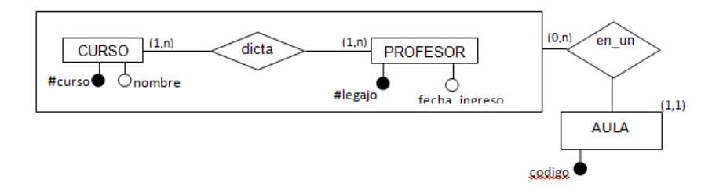

Practica Nro. 1 - Modelo de Entidades y Relaciones
==================================================

Pautas
------

En los siguientes dominios diseñar el modelo de E/R y pasar a tablas con las
siguientes consideraciones:

- Poner nombre (significativo) a todas las entidades, las relaciones y los
  atributos
- Poner atributos donde corresponda (tanto en entidades como en relaciones).
  Tener en cuenta que toda entidad debe tener atributos.
- No pueden repetirse los nombres tanto para entidades como para relaciones
- Las relaciones no pueden poseer atributos claves o partes de claves
- Identificar las claves primarias en todas las entidades
- No pueden usarse atributos compuestos o multivaluados en entidades y
  relaciones.
- Determinar y asignar cardinalidades mínimas y máximas en el modelo
- Identificar explícitamente si están modelando una generalización (G) o una
  especialización (E)
- **Todas** las entidades y relaciones **deben ser pasadas a tablas**,
  independientemente de su cardinalidad. En el caso de las generalizaciones y
  especializaciones aplicar alguno de los criterios vistos en la teoría
- Para cada tabla marcar la clave primaria

Notación gráfica a utilizarse:
------------------------------

Cardinalidades mínimas y máximas. Atributos

Como leer el modelo anterior: "Un curso es dictado como mínimo y como máximo
por un profesor, y un profesor dicta como mínimo cero y como máximo n cursos"

Donde:

- `#curso` y nombre son atributos de la entidad CURSO y #curso es la clave de la
  entidad
- `#legajo` y fecha de ingreso son atributos de la entidad PROFESOR y #legajo es
  la clave de la entidad

Agregación:

Ejercicios
----------

Para cada uno de los ejercicios propuestos, realizar:

- el modelo conceptual (empleando ER)
- el pasaje a tablas, en caso de pasar una especialización o generalización,
  explicar por qué decidió usar la estrategia utilizada, indicando ventajas y
  desventajas que le encuentra a la misma.

Sistema de Reservas de Autos
----------------------------

Se desea diseñar una base de datos sobre la información de las reservas de una
empresa dedicada al alquiler de automóviles. Un determinado cliente puede tener
en un momento dado varias reservas. Una reserva la realiza un único cliente,
pero puede involucrar a varios coches. Es importante registrar la fecha de
comienzo de la reserva y la de terminación. Todo coche tiene siempre asignado un
determinado garage, que no puede cambiar. En un garage se pueden guardar muchos
autos y de los garages se conoce la capacidad máxima de autos que se pueden
ingresar.

Cada reserva se realiza en una determinada agencia. En la base de datos pueden
existir clientes que no hayan hecho ninguna reserva.

Institución de Arte
-------------------

Una institución de arte desea mantener información acerca de cuadros. Por ello,
se quiere modelar pintores, cuadros y museos. Se sabe que un pintor pinta
cuadros y los cuadros se exponen en varios museos. Una particularidad de los
cuadros que se exponen en esta institución, es que un cuadro podría ser pintado
por varios pintores, es decir cuadros colaborativos.

De los cuadros se conoce el nombre y una descripción. De los pintores, un
nombre, la nacionalidad y la fecha de nacimiento. Mientras que de los museos se
guarda el nombre, una descripción, la dirección y la fecha de apertura.

El mismo cuadro puede ser expuesto en el mismo museo en diferentes instantes de
tiempo. Por ejemplo, se puede exponer en el Louvre del 01/02/2012 al 01/07/2012
y nuevamente entre el 25/05/2015 y el 25/8/2015.

Sistema de Venta de Inmuebles
-----------------------------

Se desea diseñar una base de datos sobre la información de las ventas
realizadas por un sistema de inmobiliarias, el cual está formado por diversas
inmobiliarias. De cada una de ellas, se conoce el nombre, dirección, teléfono y
el conjunto de empleados que trabaja para la misma (un empleado trabaja para una
única inmobiliaria).

De los empleados de cada inmobiliaria, se registra el DNI, el nombre, el
apellido, la fecha de ingreso a la misma y la fecha de nacimiento.

De cada inmueble se conoce su dirección, cantidad de habitaciones, tipo (casa,
departamento, oficina, etc.) y comodidades que brinda (pileta, patio, lavadero,
etc.).

Cada inmueble se ofrece, por una inmobiliaria durante un periodo determinado
de tiempo, es decir se conoce el rango de fechas entre el cual ese inmueble
es ofrecido por la misma. El mismo inmueble puede estar ofrecido por más de
una inmobiliaria simultáneamente, sin embargo, en caso de concretarse la
venta, solamente una de ellas la realizará. De cada inmueble ofrecido por una
inmobiliaria se conoce la forma en que ésta lo cataloga (por ejemplo: estado
bueno, regular o a demoler). Tener presente, que en caso de un ofrecimiento del
inmueble por más de una inmobiliaria simultáneamente, cada una puede catalogarlo
de una manera diferente.

Cada vez que un inmueble se ofrece para la venta, se registran los dueños
actuales. Puede haber más de un dueño por inmueble y los dueños pueden ser
personas físicas o jurídicas. Además, para cada ofrecimiento del inmueble, los
dueños pueden variar.

Cada inmobiliaria fija para cada inmueble en cada período, el precio de tasación
del mismo y el tipo de moneda en el cual se va a realizar la venta. Estos
valores pueden variar para cada periodo de tiempo.

De todas las personas se conoce un identificador que le asigna el sistema de
inmobiliarias, un nombre y, un teléfono. De las personas físicas, se registra
además, el DNI y el número de CUIL. Mientras que de las personas jurídicas se
guarda la fecha de constitución y un número de CUIT.

La venta del inmueble es realizada por una inmobiliaria en particular en un
periodo de tiempo. De cada venta se debe registrar el precio real de venta,
el/los comprador/es y el empleado de la inmobiliaria que realizó la venta del
mismo.

Red de Farmacias
----------------

Una red de farmacias desea mantener información acerca de los productos
que comercializa, sus clientes, las ventas realizadas a sus clientes y los
vendedores que trabajan en ella.

La red de farmacias posee diferentes sucursales (farmacias) ubicadas en
diferentes puntos estratégicos del país.

Los productos pueden ser de droguería, perfumería o accesorios.

En cada farmacia de la red, se pueden comercializar diferentes tipos de
productos, y un tipo de producto se puede comercializar en diferentes farmacias
de la red.

De los clientes se conoce su nombre, sus domicilios y sus teléfonos.

De los vendedores se conoce su nombre, número de legajo y fecha de ingreso a la
red de farmacias. Un vendedor puede trabajar en más de una farmacia y en una
farmacia pueden trabajar varios vendedores. Para cada vendedor se conoce en qué
horario debe estar en cada farmacia. Se sabe que un vendedor puede trabajar en
más de un turno para la misma farmacia.

De los productos se debe conocer su descripción, marca, precio unitario de costo
y precio unitario de lista (valor con el que se vende el producto al público).
Cada producto puede aparecer en diferentes formas de presentación y una forma
de presentación puede ser adoptada por diferentes productos. De la forma de
presentación se conoce el material del embalaje, el tamaño y una descripción
textual.

En una compra se registra cada producto con su correspondiente presentación.
Se debe registrar también la cantidad solicitada de ese producto con
esa presentación (tener en cuenta que el mismo producto, con diferentes
presentaciones, puede aparecer en la misma venta mas de una vez con diferentes
cantidades).

Para cada presentación de un producto involucrado en una compra, se debe
mantener información acerca de la sucursal en la que se pide y del vendedor de
esa sucursal que fue responsable de venderlo.

En el comprobante de la compra debe figurar la fecha de realización, la forma de
pago, el cliente y el domicilio de entrega (el cual no necesariamente es uno de
los domicilios registrados para el cliente)

Criadero de Pollos
------------------

Se quiere gestionar la información de un criadero de pollos, para ello se cuenta
con la siguiente información sobre cada pollo: número, fecha de nacimiento, raza
y color. No existe la posibilidad que dos pollos tengan el mismo número.

Existen diversas razas de pollos, de cada raza se guarda la descripción y se
conoce el promedio de vida de los ejemplares que pertenecen a la misma, en
particular para los que son de la raza "híbrido", se conoce el precio por kilo
de pollo.

Los pollos, dentro del criadero, están agrupados por corral de acuerdo al
alimento que consumen. Cada corral tiene un número que lo identifica, y en cada
uno se utiliza un tipo de alimento específico, aunque varios corrales pueden
usar el mismo alimento.

Los pollos pueden ir cambiando de corral a medida que transcurre el tiempo, de
manera de poder percibir distintos alimentos. Cada vez que un pollo es cambiado
de corral, se deja asentado el período que estuvo en el corral anterior. Es
decir que se tiene registro de donde estuvo cada pollo a lo largo de su vida. Un
pollo puede estar más de una vez en el mismo corral.

El alimento se clasifica en natural o balanceado, y de cada alimento se conoce
la dosis diaria. Para los alimentos naturales se desea saber la base, de la que
sólo se almacena una descripción (ej: maíz entero, maíz molido), y del alimento
balanceado interesa saber la marca y el fabricante. De cada fabricante se guarda
la dirección, la razón social y el CUIT.

Un alimento siempre se compra al mismo fabricante. Cada fabricante puede
elaborar distintos alimentos.

Músicos
-------

Se desea representar un sistema para el registro de músicos y bandas de música.
De un músico se conoce su DNI, nombre, año de nacimiento y qué instrumentos sabe
tocar.

De una banda de música se conoce su nombre, género e integrantes que la
componen.

De cada instrumento de música se conoce su nombre; además, se requiere
distinguir tres tipos de instrumentos: de cuerdas (de los cuales se conoce su
cantidad de cuerdas), de viento (de los cuales se conoce su clasificación, que
puede ser "metal" o "madera") y de percusión (de los cuales se conoce su altura,
que puede ser "definida" o "indefinida").

Si bien un músico puede tocar varios instrumentos, dentro de una banda
determinada sólo toca un instrumento. A su vez, en una misma banda, pueden haber
varios músicos que tocan el mismo instrumento.

Operativos Viales
-----------------

Un operativo vial se realiza en una jurisdicción determinada con un grupo de
agentes. Estos agentes utilizan dispositivos móviles (PDA) para labrar actas.

Los agentes detienen a los conductores de forma aleatoria y realizan un control
de documentación. En caso de constatar alguna infracción, el agente labra un
acta con una PDA tomando los siguientes datos:

- El conjunto de infracciones cometidas (por ejemplo: licencia vencida y seguro impago)
- El vehículo del conductor.
- El agente que realizó el acta.
- La jurisdicción del lugar del labrado del acta.
- La PDA utilizada para realizar el acta.
- En caso de ser necesario, un testigo.
- Foto y firma del infractor.

El número de acta es generado por la PDA y es único, de la PDA se conoce: el
imei (valor único de identificación), número de serie, marca y modelo.

De las infracciones se conoce el código de infracción (que es único), artículo,
descripción, UF (Las Unidades Fijas son valores numéricos que equivalen al
menor precio de venta al público de un litro de nafta especial) y puntos a
descontar (scoring). No todas las infracciones asociadas al acta deben aplicar
el scoring para descontar puntos en la licencia, para esto se debe registrar qué
infracciones asociadas al acta aplican scoring y cuáles no.

Además, se debe asociar al acta el precio actual del litro de nafta especial,
que junto a las UFs de cada infracción se utilizan para calcular el monto total
de la misma. Este monto se debe registrar.

Del vehículo se registra el dominio (patente), marca, modelo, tipo de vehículo,
año de patentamiento y su conductor (si bien el vehículo puede tener más de un
propietario, solo se registra el que conduce el vehículo).

El conductor posee una única licencia y al igual que el agente los datos que
se registran son: nombre, apellido, dirección, sexo, número de documento, tipo
de documento y la jurisdicción a la que pertenecen. Para el agente se registra
además el cargo y el número de legajo.

De la licencia se desea registrar: el número, la/s clase/es de licencia, fecha
de vencimiento, grupo/factor sanguíneo.

El testigo es una persona que no puede ser ni el agente ni el conductor. Del
testigo se conoce el dni, nombre, apellido, domicilio y teléfono.

Sistema de Aeropuerto
---------------------

En un aeropuerto se está efectuando el diseño de una base de datos que permita
llevar un registro de los aviones, pilotos y demás empleados que en él trabajan.
Cada avión posee un nombre, fecha del primer vuelo y número de registro, y tiene
un modelo asociado. Cada avión se guarda en un hangar determinado. Cada modelo
de avión tiene un número de modelo, una capacidad y un peso, mientras que de un
hangar se conoce su número, capacidad y ubicación. Tenga en cuenta que en un
hangar se pueden guardar varios aviones.

Para el caso de los aeroplanos (particulares), es necesario conocer los datos
del dueño (que será una persona), la fecha de compra por parte de su dueño
y los empleados del aeropuerto que hacen el mantenimiento del mismo. Cada
empleado de mantenimiento puede realizar diferentes tareas y la misma tarea
puede ser realizada por diversos empleados. Para cada tarea de un empleado de
mantenimiento, se conoce el horario en el que la realiza, teniendo en cuenta,
que un empleado puede realizar la misma tarea en diferentes horarios.

El reporte de servicios a un aeroplano se entrega continuamente, por lo que es
necesario llevar un registro de las fechas en que se hace el mantenimiento,
el número de horas incurridas y el servicio realizado y los empleados de
mantenimiento responsables del mismo.

Por otro lado, un piloto está autorizado para conducir algunos aeroplanos, según
las restricciones que presenta su licencia.

Cada empleado, en general, gana un sueldo fijo y, en el caso específico de los
pilotos se agregan adicionales por horas de vuelo registradas en un mes.

Sistema de Licitaciones
-----------------------

Se desean registrar las licitaciones de las dependencias de una provincia. De
las licitaciones se conoce la dependencia que realiza la licitación, el número
y el año en el cual se realiza la misma. Tenga en cuenta que el mismo número
de licitación se puede repetir en los distintos años y el mismo número y año
se pueden repetir en las distintas dependencias. Además de las licitaciones se
desea registrar las observaciones que pudieran realizarse, el usuario que cargó
la licitación en el sistema y en qué fecha se realizó dicha carga.

De los usuarios se registra su user_id, apellido y nombre, documento, username y
password.

Cada licitación es de un determinado tipo, del cual se conoce su descripción.
Los posibles valores para el tipo son: privada, pública o contratación directa.

Una licitación está relacionada a un expediente y un expediente solamente
puede estar relacionado a una sola licitación. De los expedientes se conoce su
característica (es un número que representa la dependencia que lo origina),
su número, el año en que se originó, su alcance (es un número) y el número de
cuerpo. Además se desea registrar el iniciador, que es un texto que dice que
persona, organismo, empresa, etc. inicia el expediente; el extracto, que es un
texto con una breve descripción del motivo del expediente y la fecha de inicio
del mismo. Los expedientes pertenecen a una dependencia.

De las dependencias se registra su nombre y tipo. Los posibles tipos de
dependencias son: Ministerio, Secretaría, Subsecretaría, Dirección Provincial o
Agencia.

Cada licitación tiene un pliego, del cual se registra el objeto, el plazo de
ejecución y el programa presupuestario del cual proviene el dinero. Los pliegos
poseen un documento el cual publica las bases de la licitación. Los documentos
se identifican por un id, se registra el nombre del archivo y se guarda el
contenido del mismo.

De cada licitación se pueden realizar uno o más llamados hasta que la misma sea
adjudicada. De cada llamado se registra el número de llamado, la fecha de inicio
y la de fin de publicación de la licitación, la fecha de apertura de ofertas y
el monto presupuestado. Desea conocerse el resultado de cada llamado.

Para el llamado en el cual se adjudica la licitación interesa conocer quién
fue el adjudicatario, en qué fecha se produjo y el monto de la oferta. Del
adjudicatario se desea conocer su CUIT, razón social y domicilio.

Empresa de Muebles
------------------

Una empresa dedicada a la construcción de muebles para el hogar, desea realizar
la base de datos para administrar la producción y la asignación horaria de sus
empleados.

La empresa está dividida en departamentos y en cada departamento se asignan
empleados. Cada empleado puede trabajar en más de un departamento y en un
departamento trabajan diversos empleados. Cada empleado realiza turnos para cada
departamento en el que trabaja. Un empleado puede realizar más de un turno en
cada departamento y en el mismo turno hay diversos empleados de un departamento
asignados.

Cada departamento se especializa en la construcción de un tipo de mueble
específico. De cada tipo de mueble se conoce la cantidad de materia prima
necesaria, la cantidad de horas hombre promedio y el volumen que ocupa.

De los departamentos se conoce el nombre, el responsable (que es un empleado
asignado al departamento) y la producción promedio del último año fiscal.

De los empleados se conoce el nombre, el apellido, el dni y un número de legajo.

De los turnos se conoce el día de la semana, la hora de inicio y la hora de fin.

